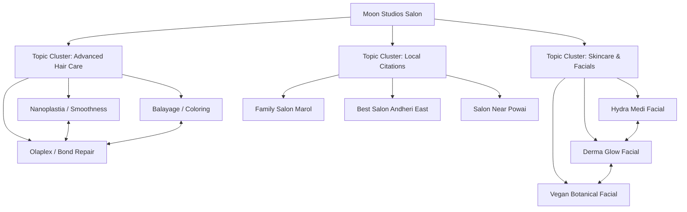

# E-E-A-T & SEO Authority Building Plan
**Moon Studios – The Family Salon**

This document outlines a comprehensive audit and implementation plan to elevate the **E-E-A-T (Experience, Expertise, Authority, Trust)** signals for Moon Studios, boosting organic search visibility, localized rankings, and brand credibility.

---

## 1. E-E-A-T Audit Scorecard

| E-E-A-T Element | Current Score | Target Score | Primary Gap / Action Needed |
| :--- | :---: | :---: | :--- |
| **Experience (E)** | `6/10` | `9/10` | Needs structured process walkthroughs and before/after case study write-ups instead of raw image grids. |
| **Expertise (E)** | `5/10` | `9/10` | Needs formal stylist credentials, certification listings, and deep technical service content. |
| **Authority (A)** | `4/10` | `8/10` | Needs topical clusters (interlinking) and local/industry citations/backlinks. |
| **Trust (T)** | `7/10` | `9.5/10` | Needs clearly stated booking policies, safety guidelines, and employee structured schema markup. |

### **Overall Score**: `5.5 / 10` $\rightarrow$ **Target**: `8.8 / 10`

---

## 2. Priority Action Plan

### **Action 1: Enhance Stylist Bios & Credentials (Expertise)**
* **Why**: Search engines favor content written or verified by certified experts (especially for skin/hair care which touches Google's Your Money or Your Life (YMYL) guidelines).
* **What to add**: Introduce years of experience, certifications (e.g., L'Oréal Professional Academy, advanced cosmetology courses), and specific style specialties for each team member.

### **Action 2: Structured Before/After Case Studies (Experience)**
* **Why**: Google highly values proof of first-hand experience (e.g., original images, detailed step-by-step case studies showing a real customer transformation).
* **What to add**: Instead of a simple before/after image, create a written process detailing the hair type, the products used (e.g., Olaplex No. 1 & 2), and the specific technique applied.

### **Action 3: Build Topical Clusters (Authority)**
* **Why**: Linking related pages together establishes topical depth. For instance, linking Nanoplastia, Olaplex, and Balayage in a "Hair Care & Transformation Hub" proves to search crawlers that Moon Studios is a comprehensive expert.
* **What to add**: Implement a structured internal linking map between specialty service landing pages.

### **Action 4: Advanced Structured Data & Schema (Trust)**
* **Why**: Rich snippets help search engines index the exact relationship between the brand, its locations, services, and staff.
* **What to add**: Add `Employee` schema with fields for `knowsAbout`, `jobTitle`, and `worksFor` inside [StructuredData.tsx](file:///E:/moon_studios/moonshine-sparkle/src/components/StructuredData.tsx).

---

## 3. Topical Authority Map (Content Clusters)

Organizing services into semantic topic clusters signals authority to Google's semantic search models.



### **Internal Linking Matrix**
* **Nanoplastia Page** $\leftrightarrow$ **Olaplex Page**: Cross-link when explaining post-straightening aftercare.
* **Hydra Medi Facial Page** $\leftrightarrow$ **Derma Glow Page**: Cross-link when comparing high-tech exfoliation vs pigment-brightening treatments.

---

## 4. Trust Optimization Checklist

Use this checklist to ensure all trust signals are displayed and crawlable:

* [x] **Privacy Policy & Terms pages** (Completed: Added [PrivacyPolicy.tsx](file:///E:/moon_studios/moonshine-sparkle/src/pages/PrivacyPolicy.tsx) and [TermsOfService.tsx](file:///E:/moon_studios/moonshine-sparkle/src/pages/TermsOfService.tsx))
* [ ] **Safety & Sterilization Policy**: Add a section on facial and tool sterilization protocols to the Skincare/Facial pages.
* [ ] **Patch Test Policy**: Clearly state patch-testing guidelines for chemical hair treatments (Nanoplastia, Balayage) and active facials.
* [ ] **Review Verification**: Link reviews directly to Google Maps or include a trust badge.
* [ ] **Guarantees**: State a customer satisfaction or adjustment policy (e.g. "Complimentary adjustments within 7 days of hair coloring if not fully satisfied").

---

## 5. Schema Markup Enhancements (JSON-LD)

To push trust signals directly to the Google Knowledge Graph, we should inject detailed `Employee` (stylist) metadata into our structured data:

```json
{
  "@context": "https://schema.org",
  "@type": "HairSalon",
  "name": "Moon Studios",
  "employee": [
    {
      "@type": "Person",
      "name": "Monica",
      "jobTitle": "Founder & Head Consultant",
      "description": "Certified skincare consultant specializing in dermal barrier restoration and advanced facials.",
      "knowsAbout": ["Dermal Facials", "Organic Skin Therapy", "Salon Management"]
    },
    {
      "@type": "Person",
      "name": "Shehzad",
      "jobTitle": "Lead Stylist & Hair Specialist",
      "description": "Master hair stylist with over 10 years of experience in Nanoplastia, Keratin, and Balayage.",
      "knowsAbout": ["Nanoplastia", "Balayage", "Olaplex Restoration", "Precision Haircuts"]
    }
  ]
}
```

---

## 6. Actionable Bio & Credentials Templates

Update [Stylists.tsx](file:///E:/moon_studios/moonshine-sparkle/src/components/Stylists.tsx) with these high-credibility descriptions:

### **Founder Bio (Monica)**
> **Monica | Founder & Head Consultant**
> * **Experience**: 8+ Years in Beauty & Wellness Consulting
> * **Specialty**: Dermal Facials, Hydra Hydration, Organic Skincare Formulations
> * **Bio**: Monica founded Moon Studios with the goal of bringing premium, transparent, and result-oriented beauty care to Andheri. She oversees every skincare formulation, ensuring high-grade dermatological and vegan botanicals are customized to the client's skin barrier needs.

### **Lead Stylist Bio (Shehzad)**
> **Shehzad | Lead Hair Artisan**
> * **Experience**: 10+ Years in Advanced Hair Styling & Nanotech Straightening
> * **Specialty**: Precision Scissors Cuts, Balayage Blending, Formaldehyde-Free Nanoplastia
> * **Bio**: Shehzad is a recognized master hair stylist who has trained extensively in global styling techniques. He specializes in complex hair repairs (using Olaplex systems) and custom-blended hair color mapping that flatters Indian skin tones and hair textures.
